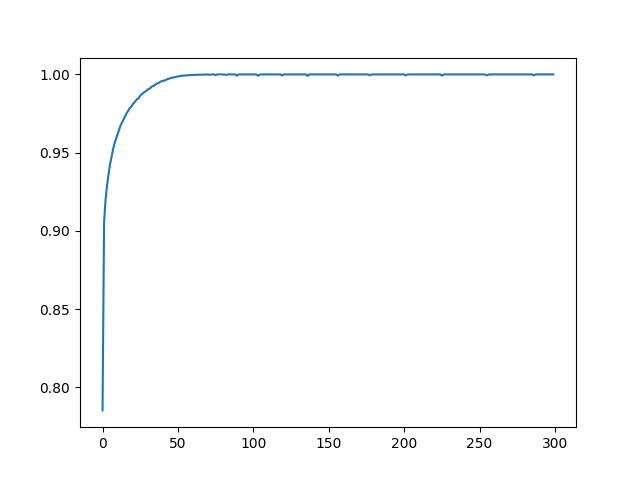

## Some-networks

Some fnn or cnn networks trained based on MNIST, FASHION MNIST and CIFAR10

---

### models

As mentioned above.

### history

Recording of Accuracy and Loss during the training process.

```python
import pickle

with open(file_name, 'rb') as f:
    history = pickle.load(f)
```
Structure of history.txt file
```python
{
  "loss": list,
  "accuracy": list,
  "val_loss": list,
  "val_accuracy": list
}
```
e.g.
```python
import pickle
import matplotlib.pyplot as plt

with open('history/mnist_fnn_3x100_tanh.txt', 'rb') as f:
    history = pickle.load(f)
plt.plot(history['accuracy'])
plt.show()
```


---
### model.eavaluate

O for overfitting, T for fitting, F for underfitting

|    | Network                              | Accuracy    | Loss        | Epochs | Fitting |
|----|--------------------------------------|-------------|-------------|--------|---------|
| 0  | cifar10_cnn_3layer_2_3_atanh         | 0.39230001  | 1.731870294 | 200    | O       |
| 1  | cifar10_cnn_3layer_2_3_sigmoid       | 0.39230001  | 1.745125413 | 200    | F       |
| 2  | cifar10_cnn_3layer_2_3_tanh          | 0.401300013 | 1.693139791 | 200    | O       |
| 3  | cifar10_cnn_3layer_4_3_atanh         | 0.452300012 | 1.545338511 | 200    | O       |
| 4  | cifar10_cnn_3layer_4_3_sigmoid       | 0.462399989 | 1.529569983 | 200    | F       |
| 5  | cifar10_cnn_3layer_4_3_tanh          | 0.467700005 | 1.493117452 | 200    | O       |
| 6  | cifar10_cnn_4layer_5_3_atanh         | 0.492000014 | 1.426735282 | 200    | O       |
| 7  | cifar10_cnn_4layer_5_3_sigmoid       | 0.446099997 | 1.577926517 | 200    | F       |
| 8  | cifar10_cnn_4layer_5_3_tanh          | 0.483500004 | 1.463118672 | 200    | O       |
| 9  | cifar10_cnn_5layer_5_3_atanh         | 0.504199982 | 1.393949628 | 200    | O       |
| 10 | cifar10_cnn_5layer_5_3_sigmoid       | 0.395000011 | 1.660577178 | 200    | F       |
| 11 | cifar10_cnn_5layer_5_3_tanh          | 0.506299973 | 1.393431902 | 200    | O       |
| 12 | cifar10_cnn_6layer_5_3_atanh         | 0.485300004 | 1.438839316 | 200    | O       |
| 13 | cifar10_cnn_6layer_5_3_sigmoid       | 0.418599993 | 1.629698753 | 200    | F       |
| 14 | cifar10_cnn_6layer_5_3_tanh          | 0.505599976 | 1.392808914 | 200    | O       |
| 15 | cifar10_fnn_3x100_atanh              | 0.49000001  | 2.468976498 | 400    | O       |
| 16 | cifar10_fnn_3x100_sigmoid            | 0.5         | 1.736727953 | 400    | O       |
| 17 | cifar10_fnn_3x100_tanh               | 0.485000014 | 2.91953063  | 400    | O       |
| 18 | cifar10_fnn_3x200_atanh              | 0.504499972 | 4.131021023 | 400    | O       |
| 19 | cifar10_fnn_3x200_sigmoid            | 0.493400007 | 2.498594284 | 400    | O       |
| 20 | cifar10_fnn_3x200_tanh               | 0.509000003 | 4.219019413 | 400    | O       |
| 21 | cifar10_fnn_3x400_atanh              | 0.533299983 | 3.399535894 | 300    | O       |
| 22 | cifar10_fnn_3x400_sigmoid            | 0.507799983 | 3.985768318 | 400    | O       |
| 23 | cifar10_fnn_3x400_tanh               | 0.539300025 | 3.422207832 | 300    | O       |
| 24 | cifar10_fnn_3x50_atanh               | 0.485799998 | 1.734962106 | 400    | O       |
| 25 | cifar10_fnn_3x50_sigmoid             | 0.490999997 | 1.533684373 | 400    | O       |
| 26 | cifar10_fnn_3x50_tanh                | 0.476999998 | 1.849790573 | 400    | O       |
| 27 | cifar10_fnn_3x700_atanh              | 0.543299973 | 3.148085356 | 300    | O       |
| 28 | cifar10_fnn_3x700_sigmoid            | 0.49090001  | 5.053500175 | 400    | O       |
| 29 | cifar10_fnn_3x700_tanh               | 0.551699996 | 3.005717278 | 300    | O       |
| 30 | cifar10_fnn_5x100_atanh              | 0.475400001 | 3.519713163 | 400    | O       |
| 31 | cifar10_fnn_5x100_sigmoid            | 0.434399992 | 1.935647607 | 400    | O       |
| 32 | cifar10_fnn_5x100_tanh               | 0.483799994 | 3.8575387   | 400    | O       |
| 33 | fashion_mnist_cnn_3layer_2_3_atanh   | 0.868399978 | 0.376832366 | 100    | T       |
| 34 | fashion_mnist_cnn_3layer_2_3_sigmoid | 0.842700005 | 0.441343933 | 100    | T       |
| 35 | fashion_mnist_cnn_3layer_2_3_tanh    | 0.861899972 | 0.377617687 | 100    | T       |
| 36 | fashion_mnist_cnn_3layer_4_3_atanh   | 0.876399994 | 0.344985485 | 100    | T       |
| 37 | fashion_mnist_cnn_3layer_4_3_sigmoid | 0.858099997 | 0.40440312  | 100    | T       |
| 38 | fashion_mnist_cnn_3layer_4_3_tanh    | 0.877399981 | 0.344874114 | 100    | T       |
| 39 | fashion_mnist_cnn_4layer_5_3_atanh   | 0.886099994 | 0.318834513 | 100    | T       |
| 40 | fashion_mnist_cnn_4layer_5_3_sigmoid | 0.850899994 | 0.418863416 | 100    | T       |
| 41 | fashion_mnist_cnn_4layer_5_3_tanh    | 0.892400026 | 0.31145826  | 100    | T       |
| 42 | fashion_mnist_cnn_5layer_5_3_atanh   | 0.885500014 | 0.325504482 | 100    | T       |
| 43 | fashion_mnist_cnn_5layer_5_3_sigmoid | 0.839299977 | 0.450342685 | 100    | T       |
| 44 | fashion_mnist_cnn_5layer_5_3_tanh    | 0.8847      | 0.31554538  | 100    | T       |
| 45 | fashion_mnist_cnn_6layer_5_3_atanh   | 0.878600001 | 0.336376607 | 100    | T       |
| 46 | fashion_mnist_cnn_6layer_5_3_sigmoid | 0.828700006 | 0.476394296 | 100    | T       |
| 47 | fashion_mnist_cnn_6layer_5_3_tanh    | 0.885500014 | 0.320123613 | 100    | T       |
| 48 | fashion_mnist_fnn_3x100_atanh        | 0.880800009 | 0.653665125 | 300    | O       |
| 49 | fashion_mnist_fnn_3x100_sigmoid      | 0.880900025 | 0.422061622 | 300    | O       |
| 50 | fashion_mnist_fnn_3x100_tanh         | 0.878600001 | 0.808701634 | 300    | O       |
| 51 | fashion_mnist_fnn_3x200_atanh        | 0.888800025 | 0.79422754  | 300    | O       |
| 52 | fashion_mnist_fnn_3x200_sigmoid      | 0.882799983 | 0.528309107 | 300    | O       |
| 53 | fashion_mnist_fnn_3x200_tanh         | 0.890299976 | 0.813866079 | 300    | O       |
| 54 | fashion_mnist_fnn_3x400_atanh        | 0.899399996 | 0.747359395 | 300    | O       |
| 55 | fashion_mnist_fnn_3x400_sigmoid      | 0.885999978 | 0.636282027 | 300    | O       |
| 56 | fashion_mnist_fnn_3x400_tanh         | 0.897000015 | 0.764274001 | 300    | O       |
| 57 | fashion_mnist_fnn_3x50_atanh         | 0.879400015 | 0.48898983  | 300    | O       |
| 58 | fashion_mnist_fnn_3x50_sigmoid       | 0.880900025 | 0.369477957 | 300    | T       |
| 59 | fashion_mnist_fnn_3x50_tanh          | 0.879800022 | 0.530318737 | 300    | O       |
| 60 | fashion_mnist_fnn_3x700_atanh        | 0.902800024 | 0.734414816 | 300    | O       |
| 61 | fashion_mnist_fnn_3x700_sigmoid      | 0.887799978 | 0.708239257 | 300    | O       |
| 62 | fashion_mnist_fnn_3x700_tanh         | 0.897099972 | 0.76085937  | 300    | O       |
| 63 | fashion_mnist_fnn_5x100_atanh        | 0.881299973 | 0.885584772 | 300    | O       |
| 64 | fashion_mnist_fnn_5x100_sigmoid      | 0.870899975 | 0.490796924 | 300    | O       |
| 65 | fashion_mnist_fnn_5x100_tanh         | 0.881600022 | 0.922964334 | 300    | O       |
| 66 | mnist_cnn_3layer_2_3_atanh           | 0.968800008 | 0.103184864 | 100    | T       |
| 67 | mnist_cnn_3layer_2_3_sigmoid         | 0.937900007 | 0.224567205 | 100    | T       |
| 68 | mnist_cnn_3layer_2_3_tanh            | 0.971700013 | 0.094990723 | 100    | T       |
| 69 | mnist_cnn_3layer_4_3_atanh           | 0.979900002 | 0.063968308 | 100    | T       |
| 70 | mnist_cnn_3layer_4_3_sigmoid         | 0.948899984 | 0.189615831 | 100    | T       |
| 71 | mnist_cnn_3layer_4_3_tanh            | 0.981400013 | 0.058522966 | 100    | T       |
| 72 | mnist_cnn_4layer_5_3_atanh           | 0.98299998  | 0.052840937 | 100    | T       |
| 73 | mnist_cnn_4layer_5_3_sigmoid         | 0.966499984 | 0.122504026 | 100    | T       |
| 74 | mnist_cnn_4layer_5_3_tanh            | 0.983099997 | 0.051382855 | 100    | T       |
| 75 | mnist_cnn_5layer_5_3_atanh           | 0.983299971 | 0.05485028  | 100    | T       |
| 76 | mnist_cnn_5layer_5_3_sigmoid         | 0.959299982 | 0.153943881 | 100    | T       |
| 77 | mnist_cnn_5layer_5_3_tanh            | 0.984600008 | 0.048915245 | 100    | T       |
| 78 | mnist_cnn_6layer_5_3_atanh           | 0.984099984 | 0.046042606 | 100    | T       |
| 79 | mnist_cnn_6layer_5_3_sigmoid         | 0.96450001  | 0.12740235  | 100    | T       |
| 80 | mnist_cnn_6layer_5_3_tanh            | 0.983699977 | 0.048359387 | 100    | T       |
| 81 | mnist_fnn_3x100_atanh                | 0.977500021 | 0.191970661 | 300    | O       |
| 82 | mnist_fnn_3x100_sigmoid              | 0.976400018 | 0.224613279 | 300    | O       |
| 83 | mnist_fnn_3x100_tanh                 | 0.978999972 | 0.166348934 | 300    | O       |
| 84 | mnist_fnn_3x200_atanh                | 0.978900015 | 0.171338275 | 300    | O       |
| 85 | mnist_fnn_3x200_sigmoid              | 0.978600025 | 0.206714764 | 300    | O       |
| 86 | mnist_fnn_3x200_tanh                 | 0.980599999 | 0.172831967 | 300    | O       |
| 87 | mnist_fnn_3x400_atanh                | 0.98210001  | 0.140465453 | 300    | O       |
| 88 | mnist_fnn_3x400_sigmoid              | 0.979600012 | 0.164936692 | 300    | O       |
| 89 | mnist_fnn_3x400_tanh                 | 0.984000027 | 0.133739337 | 300    | O       |
| 90 | mnist_fnn_3x50_atanh                 | 0.968599975 | 0.251973987 | 300    | O       |
| 91 | mnist_fnn_3x50_sigmoid               | 0.966700017 | 0.16925545  | 300    | O       |
| 92 | mnist_fnn_3x50_tanh                  | 0.971800029 | 0.247934133 | 300    | O       |
| 93 | mnist_fnn_3x700_atanh                | 0.983299971 | 0.130347863 | 300    | O       |
| 94 | mnist_fnn_3x700_sigmoid              | 0.980000019 | 0.161023691 | 300    | O       |
| 95 | mnist_fnn_3x700_tanh                 | 0.984300017 | 0.119473465 | 300    | O       |
| 96 | mnist_fnn_5x100_atanh                | 0.976700008 | 0.196811914 | 300    | O       |
| 97 | mnist_fnn_5x100_sigmoid              | 0.965399981 | 0.250923783 | 300    | O       |
| 98 | mnist_fnn_5x100_tanh                 | 0.976999998 | 0.189824581 | 300    | O       |
